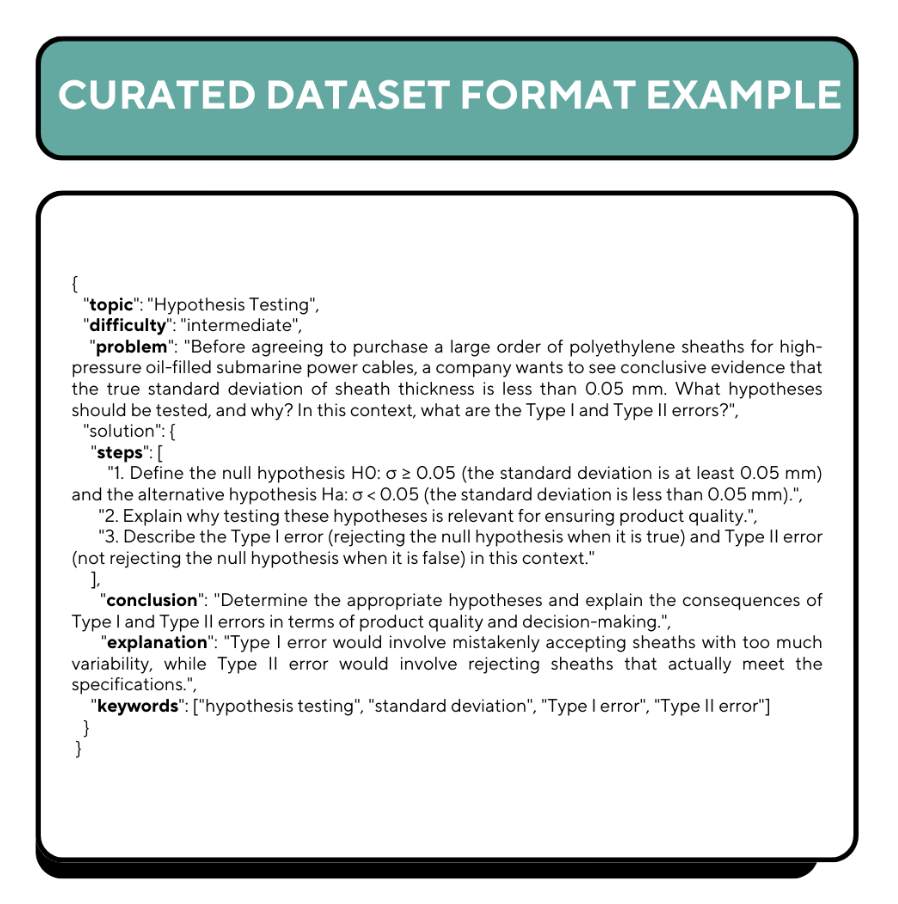
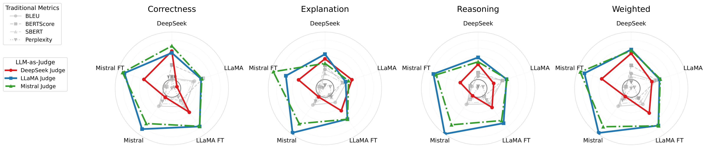

# Can LLM Reasoning Be Trusted? A Comparative Study: Using Human Benchmarking on Statistical Tasks

[](fine_tuning_LLMs_for_statistics__new_ownership_\(16\).pdf)
[](LICENSE)
[](https://www.python.org/downloads/)

> **Authors**: Crish Nagarkar¹, Leonid Bogachev¹, Serge Sharoff²
> ¹Department of Statistics, School of Mathematics
> University of Leeds, Leeds LS2 9JT, UK

---

## Abstract

This research investigates the ability of large language models (LLMs) to solve statistical tasks and their capacity to assess the quality of reasoning. We fine-tuned selected open-source LLMs on a specially developed dataset of **2,000 statistical questions** to enhance their statistical reasoning capabilities, and compared their performance with human expert benchmarks.

**Key Contributions**:
- **Fine-tuned models achieve +34.18% improvement** (Mistral) on advanced statistical tasks, reaching performance comparable to statistics students
- **LLM-as-Judge methods significantly outperform traditional metrics** (BLEU, BERTScore), with Kendall's τ correlations up to **0.67** vs <0.25 for traditional metrics
- Comprehensive benchmark dataset spanning hypothesis testing, regression, probability theory, ANOVA, and Bayesian statistics
- Empirical demonstration that automated metrics systematically fail to capture statistical reasoning quality

---

## Table of Contents

- [Research Questions](#research-questions)
- [Dataset](#dataset)
- [Models & Fine-Tuning](#models--fine-tuning)
- [Evaluation Framework](#evaluation-framework)
- [Results & Key Findings](#results--key-findings)
- [Project Structure](#project-structure)
- [Getting Started](#getting-started)
- [Reproducing Results](#reproducing-results)
- [Citation](#citation)
- [Acknowledgments](#acknowledgments)

---

## Research Questions

**RQ1**: Can parameter-efficient fine-tuning (LoRA) improve the statistical reasoning capabilities of base LLMs?

**RQ2**: Which automatic metrics most reliably align with human judgments of correctness?

**RQ3**: What are the key failure modes and generalization limitations of fine-tuned models in statistical reasoning, and where do automated metrics systematically diverge from human evaluation?

---

## Dataset

### 2,000-Question Training Corpus

Our curated dataset addresses limitations of existing benchmarks (MATH, UCI-MLR, STATLOG) by emphasizing both numerical computation and interpretive reasoning.

#### Dataset Composition

| Source | Percentage | Description |
|--------|-----------|-------------|
| **Open-access resources** | 63% | OpenIntro, OpenStax, OnlineStatBook, Kozak (2025) |
| **Academic textbooks** | 34% | Ross, DeGroot & Schervish, Wasserman, Blitzstein & Hwang, Devore, Gelman et al. |
| **Custom-developed** | 3% | Advanced multi-door Monty Hall, complex ANOVA designs, specialized scenarios |

#### Topic Distribution (50-Question Test Set)

| Topic | Basic | Intermediate | Advanced | Avg. Words |
|-------|-------|--------------|----------|------------|
| **Probability** | 200 | 150 | 50 | 30.4 |
| **Hypothesis Testing** | 150 | 100 | 100 | 84.8 |
| **Regression Analysis** | 100 | 150 | 200 | 47.0 |
| **Time Series Analysis** | 50 | 75 | 100 | 26.4 |
| **ANOVA & Bayesian Stats** | 25 | 75 | 100 | 67.1 |



**Question Formats**:
- **Numerical answer questions**: Direct computational outputs (regression slopes, probabilities, test statistics)
- **Free-text questions**: Structured reasoning, stepwise calculations, statistical interpretation

---

## Models & Fine-Tuning

### Base Models Evaluated

| Model | Parameters | Architecture | Specialization |
|-------|-----------|--------------|----------------|
| **LLaMA-3 8B** | 8B | Meta's 2024 open-weight model | Strong language understanding, efficient scaling |
| **Mistral-Nemo 7B** | 7B | Dense transformer with GQA | Grouped-query attention, sliding window decoding |
| **DeepSeek-R1-Qwen 7B** | 7B | Pre-fine-tuned by DeepSeek | Long-context, mathematical reasoning |

### Parameter-Efficient Fine-Tuning (LoRA + 8-bit Quantization)

**Methodology**:
- **LoRA** (Low-Rank Adaptation): Adapts models without full retraining
- **8-bit Quantization**: Reduces weight precision (32-bit → 8-bit integers)
- **Memory Savings**: >99.8% reduction, enabling training on NVIDIA Tesla T4 GPUs (14.7GB VRAM)

**Training Configuration**:
```python
# LoRA configuration
lora_config = LoRAConfig(
    r=8,
    lora_alpha=16,
    target_modules=["q_proj", "v_proj"],
    lora_dropout=0.05,
    bias="none"
)

# 8-bit quantization
bnb_config = BitsAndBytesConfig(
    load_in_8bit=True,
    bnb_8bit_compute_dtype=torch.float16
)
```

**Fine-tuning Results**:
- **LLaMA-3**: Trained on statistical textbooks
- **Mistral-Nemo**: Trained on statistical textbooks
- **DeepSeek-R1-Qwen**: Pre-fine-tuned by developers (different corpus)

---

## Evaluation Framework

### Three-Dimensional Human Assessment

Each response graded on weighted rubric (0-5 scale, half-point increments):

| Dimension | Weight | Description |
|-----------|--------|-------------|
| **Correctness (C)** | 40% | Consistency with benchmark results, final answer accuracy |
| **Explanation (E)** | 35% | Logical structuring, derivation clarity, methodological soundness |
| **Reasoning (R)** | 25% | Conceptual clarity, statistical justification, understanding depth |

**Weighted Score Formula**:
```
W = (C × 0.40) + (E × 0.35) + (R × 0.25)
```

**Human Evaluation**:
- **Judges**: Multiple PhD students from Department of Statistics (University of Leeds)
- **Test Set**: 50 held-out questions × 5 models = 250 evaluations
- **Inter-rater Agreement**: Kendall's τ used to assess consistency
- **Aggregation**: Arithmetic mean across judges for robustness

### Automated Metrics

#### Traditional Metrics

| Metric | Description | Range |
|--------|-------------|-------|
| **BLEU** | N-gram overlap with reference solution | 0-1 |
| **BERTScore F1** | Semantic similarity using BERT embeddings | 0-1 |
| **SBERT Similarity** | Cosine similarity of sentence embeddings | 0-1 |
| **Perplexity** | Model confidence in probabilistic text generation | 0-10 |

#### LLM-as-Judge

**Judge Models**:
- DeepSeek-R1-Distill-Qwen-7B
- Meta-Llama-3-8B-Instruct
- Mistralai/Mistral-Nemo-Instruct-2407

**Advantages over Traditional LLM-as-Judge**:
1. **Domain-specific knowledge**: Acquired through statistical fine-tuning
2. **No external dependencies**: Eliminates API costs (vs GPT-4, Claude)
3. **Replicability**: Fully open-source, reproducible setup

**Prompt Template** (see Appendix A in paper):
```
You are a Professor of Statistics. Evaluate the student solution on:
• Correctness (0-5): Mathematical accuracy vs gold standard
• Explanation (0-5): Clear, logical steps
• Reasoning (0-5): Conceptual understanding

Question: {question}
Gold Standard: {correct_solution}
Student Solution: {student_solution}
```

### Meta-Evaluation Metrics

To assess **metric reliability** against human judgment:

| Meta-Metric | Description | Interpretation |
|-------------|-------------|----------------|
| **MAE** (Mean Absolute Error) | Normalized sum of absolute deviations | Lower = better alignment |
| **Wilcoxon Signed-Rank Test** | Paired test on rank differences (p-value) | p > 0.05 = scores statistically similar |
| **Kendall's τ** | Rank correlation | -1 to +1; higher = stronger agreement |

---

## Results & Key Findings

### 1. Fine-Tuning Substantially Improves Performance

| Model | Correctness | Explanation | Reasoning | Weighted | Improvement |
|-------|-------------|-------------|-----------|----------|-------------|
| **DeepSeek-R1-Qwen 7B** | 4.257 | 4.528 | 4.623 | 4.443 | — (pre-optimized) |
| **LLaMA Base** | 2.512 | 3.563 | 3.515 | 3.131 | — |
| **LLaMA FT** | 3.397 | 3.648 | 3.738 | 3.570 | **+14.02%** |
| **Mistral Base** | 2.887 | 3.407 | 3.473 | 3.215 | — |
| **Mistral FT** | 4.193 | 4.373 | 4.425 | 4.314 | **+34.18%** |

**Key Observations**:
- **Mistral shows dramatic improvement** post-fine-tuning, surpassing LLaMA FT across all dimensions
- **DeepSeek excels in Reasoning** (4.623), reflecting specialized mathematical pre-training
- **Fine-tuning benefits vary by architecture**: Mistral (+34%) vs LLaMA (+14%)

### 2. LLM-as-Judge Vastly Outperforms Traditional Metrics

**Correlation with Human Evaluation (Kendall's τ)**:

| Metric | Correctness | Explanation | Reasoning | Weighted | **Average** |
|--------|-------------|-------------|-----------|----------|-------------|
| **Perplexity** | 0.021 | 0.036 | 0.029 | 0.026 | **0.028** |
| **BLEU** | 0.110 | 0.079 | 0.086 | 0.098 | **0.093** |
| **SBERT Similarity** | 0.080 | 0.071 | 0.096 | 0.082 | **0.082** |
| **BERTScore** | 0.047 | -0.006 | 0.001 | 0.022 | **0.016** |
| **DeepSeek Judge** | 0.275 | 0.209 | 0.210 | 0.298 | **0.248** |
| **LLaMA FT Judge** | **0.474** | **0.521** | **0.476** | **0.536** | **0.502** |
| **Mistral FT Judge** | **0.461** | **0.456** | **0.450** | **0.482** | **0.462** |

**MAE (Mean Absolute Error) - Lower is Better**:

| Metric | C | E | R | W | Average |
|--------|---|---|---|---|---------|
| Traditional (best: SBERT) | 1.282 | 1.185 | 1.156 | 1.177 | **1.200** |
| **LLaMA FT Judge** | **0.764** | **0.612** | **0.607** | **0.625** | **0.652** |
| **Mistral FT Judge** | **0.793** | **0.631** | **0.670** | **0.645** | **0.685** |

**Conclusion**: LLM-as-judge achieves:
- **5-20× better correlation** (τ = 0.46-0.54 vs 0.02-0.11)
- **~45% lower error** (MAE = 0.65-0.69 vs 1.20)

### 3. Model-Specific Evaluation Patterns



*Figure: Kendall's τ correlation between evaluation metrics and human scores across four dimensions (Correctness, Explanation, Reasoning, Weighted). LLM-as-judge methods (colored lines) demonstrate substantially higher correlation with human evaluation compared to traditional automated metrics (gray lines).*

**Detailed Kendall's τ by Target Model** (LLM Judges vs Human):

| Judge Model | DeepSeek | LLaMA Base | LLaMA FT | Mistral Base | Mistral FT |
|-------------|----------|------------|----------|--------------|------------|
| **DeepSeek Judge** (Weighted) | **0.370** | 0.180 | 0.306 | 0.017 | 0.311 |
| **LLaMA FT Judge** (Weighted) | 0.424 | 0.293 | 0.525 | **0.654** | 0.567 |
| **Mistral FT Judge** (Weighted) | 0.411 | 0.304 | 0.530 | 0.546 | **0.629** |

**Key Insights**:
- **DeepSeek Judge is fairest to its own output** (τ = 0.370), showing self-awareness
- **DeepSeek Judge struggles with LLaMA/Mistral Base** (τ = 0.017-0.180) — fails to detect errors
- **LLaMA/Mistral Judges excel at evaluating high-quality outputs** (τ = 0.52-0.65 for FT models)
- **Judge bias**: Tendency to award higher marks to incorrect answers ("sycophancy" phenomenon)

### 4. Cross-Metric Consistency Analysis

**Standard Deviation Across Architectures**:
- **BERTScore**: s = 0.028 (most consistent)
- **BLEU**: s = 0.067 (moderate variance)
- **DeepSeek Judge**: s = 0.159 (good consistency)
- **LLaMA FT Judge**: s = 0.394 (highest variance)
- **Mistral FT Judge**: s = 0.362

**Inter-Judge Correlation**:
- DeepSeek ↔ LLaMA FT: r = 0.436
- DeepSeek ↔ Mistral FT: r = 0.555
- **LLaMA FT ↔ Mistral FT**: r = **0.851** (strong consensus)

**Implication**: Comprehensive evaluation requires multiple LLM judges to capture diverse aspects of reasoning quality.

### 5. Failure Modes & Limitations

**Traditional Metrics Fail Because**:
- **Surface-form similarity bias**: Rewrites with different wording score poorly
- **Cannot assess logical validity**: Syntactically correct but mathematically wrong answers score high
- **No conceptual understanding**: Miss subtle errors in statistical interpretation

**LLM-as-Judge Limitations** (from Appendix examples):
- **Overly lenient on incorrect solutions**: DeepSeek Judge scored a flawed Markov chain solution as 3.5/5 when it deserved <2/5
- **Missed critical errors**: Failed to detect wrong transition matrix, incorrect stationary distribution usage
- **Sycophancy effect**: Preference for awarding higher marks even when logic is fundamentally broken

---

## Project Structure

```
github/
├── README.md                                    # This file
├── images/                                      # Visualizations for README
│   ├── dataset_example.png                      # Example question format
│   └── radar_chart.pdf                          # Correlation analysis visualization
├── automated_metrics/
│   └── automated_metrics.csv                    # 250 rows (50Q × 5 models)
├── model_responses/
│   ├── DeepSeek r1 responses.json               # DeepSeek outputs
│   ├── llama3_responses_fixed.json              # LLaMA base outputs
│   ├── Fine tuned LLAMA.json                    # LLaMA fine-tuned outputs
│   ├── Mistral copy.json                        # Mistral base outputs
│   ├── Fine tuned Mistral.json                  # Mistral fine-tuned outputs
│   └── solution bank.json                       # Gold standard solutions (50Q)
├── questions/
│   └── Question Bank (1).pdf                    # 50 test questions
├── llm_judges/
│   └── LLM as Judge scores.xlsx                 # Scores from 3 judge models
├── human_evaluation/
│   └── Muxi Li completed markheet.xlsx          # Expert human evaluations
└── scripts/
    ├── automated metric/
    │   └── generate_automated_metrics_complete.py  # Compute BLEU, BERTScore, etc.
    ├── llm as judge/
    │   └── kaggle_llm_judge.py                  # LLM-as-judge evaluation
    └── radar/
        └── radar_chart_fix.py                   # Correlation visualizations
```

---

## Getting Started

### Prerequisites

```bash
# Python 3.8+
pip install transformers accelerate bitsandbytes torch
pip install sentence-transformers bert-score nltk
pip install pandas numpy scipy scikit-learn matplotlib
```

### Installation

```bash
git clone https://github.com/yourusername/llm-statistical-reasoning.git
cd llm-statistical-reasoning
pip install -r requirements.txt
```

---

## Reproducing Results

### Step 1: Generate Automated Metrics

```bash
cd scripts/automated\ metric/
python generate_automated_metrics_complete.py /path/to/data
```

**Input**: Model response JSONs + reference solutions
**Output**: `automated_metrics.csv` (250 rows: 50Q × 5 models)

**Metrics Computed**: BLEU, BERTScore-F1, SBERT Similarity, Perplexity, Word Overlap, Length Similarity, Character Similarity, Quality Score

### Step 2: Run LLM-as-Judge Evaluation

```bash
cd scripts/llm\ as\ judge/
python kaggle_llm_judge.py
```

**Judge Models Used**:
1. DeepSeek-R1-Distill-Qwen-7B
2. Meta-Llama-3-8B-Instruct
3. Mistralai/Mistral-Nemo-Instruct-2407

**Outputs**:
- `judge_DeepSeek_*_scores.csv` (individual judge results)
- `judge_Llama_*_scores.csv`
- `judge_Mistral_*_scores.csv`
- `all_llm_judge_results.csv` (combined)

**Optimization**: 4-bit quantization (BitsAndBytes) for Kaggle GPU constraints

### Step 3: Visualize Correlation Results

```bash
cd scripts/radar/
python radar_chart_fix.py
```

**Outputs**:
- `table4_radar_chart_shifted.pdf`
- `table4_radar_chart_shifted.png`

**Visualization**: Radar charts comparing Kendall's τ correlations across:
- Traditional metrics (BLEU, BERTScore, SBERT, Perplexity)
- LLM-as-judge (DeepSeek, LLaMA FT, Mistral FT)
- Four dimensions (Correctness, Explanation, Reasoning, Weighted)

---

## Key Implementation Details

### Fine-Tuning Configuration

```python
# LoRA + 8-bit quantization for memory efficiency
from transformers import AutoModelForCausalLM, BitsAndBytesConfig
from peft import LoraConfig, get_peft_model

bnb_config = BitsAndBytesConfig(
    load_in_8bit=True,
    bnb_8bit_compute_dtype=torch.float16
)

lora_config = LoraConfig(
    r=8,                          # Low-rank dimension
    lora_alpha=16,                # Scaling factor
    target_modules=["q_proj", "v_proj"],
    lora_dropout=0.05,
    bias="none",
    task_type="CAUSAL_LM"
)

# Load base model with quantization
model = AutoModelForCausalLM.from_pretrained(
    "meta-llama/Meta-Llama-3-8B",
    quantization_config=bnb_config,
    device_map="auto"
)

# Apply LoRA
model = get_peft_model(model, lora_config)
```

**Memory Savings**: ~99.8% reduction → enables T4 GPU training (14.7GB VRAM)

### LLM-as-Judge Scoring

```python
def get_judge_scores(model, tokenizer, problem, correct_solution, student_response):
    """Extract Correctness, Explanation, Reasoning scores (0-5 scale)"""

    prompt = judge_prompt_template.format(
        problem=problem[:500],
        correct_solution=correct_solution[:300],
        student_response=student_response[:500]
    )

    # Generate with multiple temperature attempts
    for attempt in range(3):
        outputs = model.generate(
            inputs,
            temperature=0.7 + (attempt * 0.1),
            top_p=0.9,
            max_new_tokens=50
        )

        scores = parse_scores(outputs)  # Extract 3 numbers
        if scores != (2.5, 2.5, 2.5):   # Not default fallback
            return scores

    return (2.5, 2.5, 2.5)  # Fallback for parsing failures
```

**Robustness**: Multiple temperature attempts + regex parsing for score extraction

---

## License

This project is released under the MIT License. See `LICENSE` file for details.

**Dataset Licensing**:
- Open-access components: CC BY 4.0 (OpenIntro, OpenStax) / CC BY-SA 3.0
- Academic textbook adaptations: Educational fair use with proper attribution
- Custom questions: MIT License

---

## Contact

**Crish Nagarkar**
Department of Statistics, University of Leeds
Email: C.A.Nagarkar@leeds.ac.uk

For questions, collaboration opportunities, or dataset access requests, please open an issue on this repository.

---

**Last Updated**: January 2026
